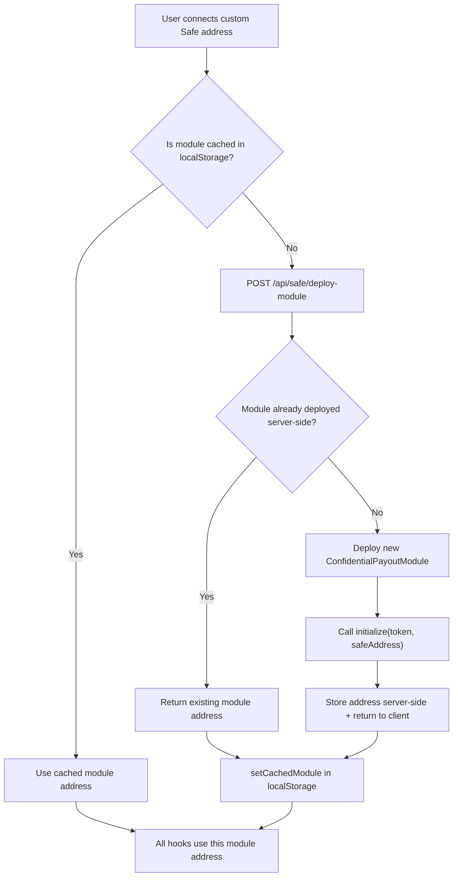
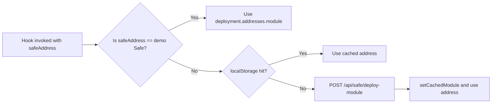

# Module Isolation Architecture

Each Gnosis Safe address gets a dedicated `ConfidentialPayoutModule` deployment. This design is central to the security and accounting correctness of Safety.

## Why Isolation Matters

If multiple Safe accounts shared a single module contract, their encrypted balances would intermingle. A deposit from Safe A would be indistinguishable from a deposit from Safe B in the encrypted accounting, and a payout request from Safe A could theoretically drain funds deposited by Safe B.

By deploying one module per Safe, each treasury's encrypted balance and payout queue is entirely independent.

## Module Deployment Flow



## Server-Side Deployment API

The `/api/safe/deploy-module` route handles module creation:

1. Checks if a module for `safeAddress` + `networkKey` already exists in its in-memory map.
2. If not, deploys a new `ConfidentialPayoutModule` using the deployer private key.
3. Calls `initialize(usdcTokenAddress, safeAddress)` on the newly deployed contract.
4. Returns the module address.

```typescript
// Simplified server logic
const existingModule = moduleMap.get(`${networkKey}:${safeAddress}`);
if (existingModule) return { moduleAddress: existingModule };

const moduleAddress = await deployContract(ConfidentialPayoutModuleBytecode);
await writeContract(moduleAddress, "initialize", [usdcToken, safeAddress]);
moduleMap.set(`${networkKey}:${safeAddress}`, moduleAddress);
return { moduleAddress };
```

## Client-Side localStorage Cache

Because the Next.js server restarts lose their in-memory state, Safety caches module addresses client-side in `localStorage`.

**Key format:** `safety_module:<networkKey>:<safeAddress (lowercase)>`

**Example key:** `safety_module:sepolia:0xa3aefb2adb03bcf57033a0c4376361696ab71517`

**Value:** Checksummed module address string.

```typescript
// From lib/utils/module-cache.ts
export function getCachedModule(networkKey: string, safeAddress: string): string | null {
  if (typeof window === "undefined") return null;
  return localStorage.getItem(`safety_module:${networkKey}:${safeAddress.toLowerCase()}`);
}

export function setCachedModule(networkKey: string, safeAddress: string, moduleAddress: string): void {
  if (typeof window === "undefined") return;
  localStorage.setItem(`safety_module:${networkKey}:${safeAddress.toLowerCase()}`, moduleAddress);
}
```

This ensures all hooks (`useDepositToTreasury`, `useProposePayout`, `useFinalizePayout`, `usePayouts`) resolve the same module address on every page load, even after a server restart.

## Module Resolution Order

All hooks that need the module address follow the same resolution priority:

1. **Explicit prop**: If `safeAddress` prop differs from the demo Safe, treat it as a custom Safe.
2. **localStorage**: Check `getCachedModule(networkKey, safeAddress)`.
3. **API fallback**: POST to `/api/safe/deploy-module` if not cached.
4. **Deployment default**: Use `deployment.addresses.module` for the demo Safe.


