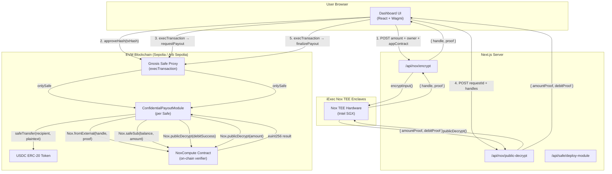
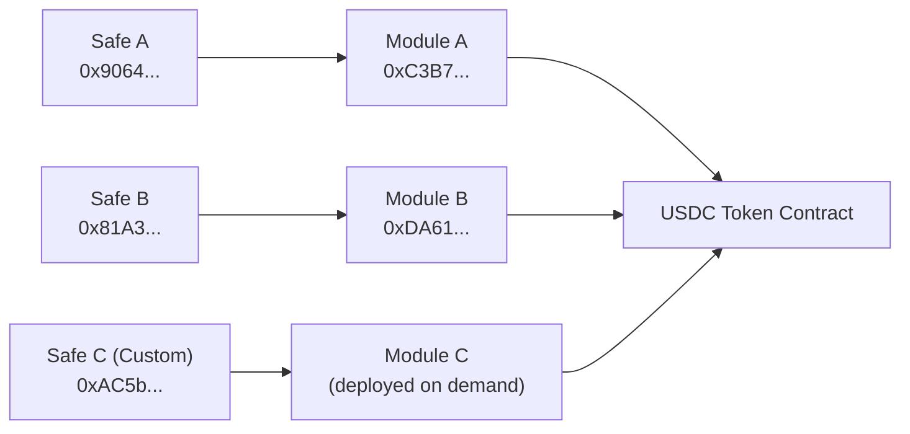

# Architecture Overview

Safety is composed of three distinct layers that work together to deliver confidential treasury payouts:

1. **Smart Contract Layer** — The `ConfidentialPayoutModule` deployed per Safe.
2. **TEE Layer** — iExec Nox TEE enclaves that handle encrypted arithmetic and proof generation.
3. **Application Layer** — The Next.js frontend and server-side API routes that bridge user actions to on-chain calls.

## System Architecture Diagram

## Layer Responsibilities

### Browser Layer

The browser handles all user interactions, wallet connections, and orchestrates the multi-step payout flow:

- Reads Safe state (owners, threshold, module enabled status, USDC balance) using Wagmi `useReadContract` hooks.
- Calls the Next.js API to encrypt amounts before they are included in Safe transaction calldata.
- Signs and broadcasts `approveHash` and `execTransaction` calls using Wagmi's `useWriteContract`.
- Resolves the correct `ConfidentialPayoutModule` address per Safe from `localStorage` cache.

### Next.js API Layer

The server handles operations that require the `@iexec-nox/handle` SDK, which requires a wallet client to sign TEE requests:

- `/api/nox/encrypt` — Takes a plaintext amount and returns `(handle, proof)` pair via `handleClient.encryptInput()`.
- `/api/nox/public-decrypt` — Takes encrypted handles and returns public decryption proofs via the Nox TEE.
- `/api/safe/deploy-module` — Deploys a new `ConfidentialPayoutModule` instance for a given Safe address if one does not exist.

### Smart Contract Layer

The `ConfidentialPayoutModule` runs on-chain and contains all treasury accounting logic:

- Maintains an encrypted USDC balance (`euint256 encryptedBalance`).
- Validates encrypted payout requests via `Nox.fromExternal`.
- Performs encrypted balance deduction via `Nox.safeSub` and `Nox.select`.
- Settles payouts by verifying public decryption proofs and calling `IERC20.safeTransfer`.

## Module Isolation Per Safe

Each Gnosis Safe gets its own dedicated `ConfidentialPayoutModule` deployment. This provides:

- Complete balance isolation between different Safe treasuries.
- No shared encrypted state between organizations.
- Independent USDC balances and payout queues per Safe.

## Data Flow Summary

| Step | Actor | Action | Result |
|---|---|---|---|
| 1 | Browser → API | POST amount to `/api/nox/encrypt` | Returns `handle` + `proof` |
| 2 | Browser → Safe | `approveHash(safeTxHash)` | Signer approval registered |
| 3 | Browser → Safe | `execTransaction → requestPayout` | `PendingPayout` stored on-chain |
| 4 | Browser → API | POST handles to `/api/nox/public-decrypt` | Returns decryption proofs |
| 5 | Browser → Safe | `execTransaction → finalizePayout` | USDC transferred to recipient |
