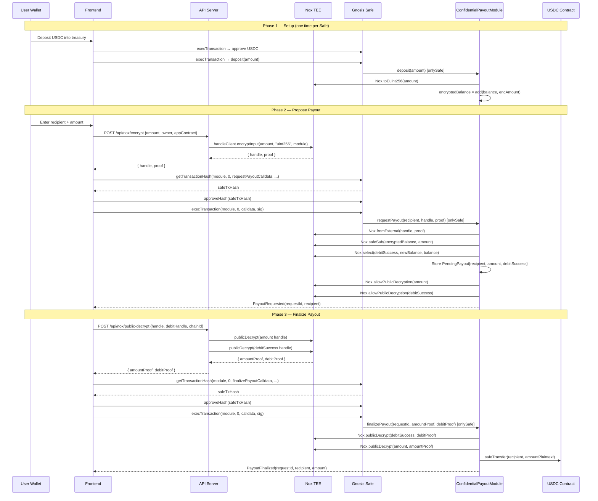

# End-to-End Payout Flow

A complete confidential payout from proposal to settlement involves two Safe `execTransaction` calls and two iExec Nox TEE interactions. This page documents each step in detail.

## Complete Flow Diagram



## Step 1: Client-Side Encryption

Before any transaction is submitted, the payout amount is encrypted by the iExec Nox TEE via the Next.js API server.

**Request to `/api/nox/encrypt`:**

```json
{
  "amount": "5000000",
  "owner": "0xA3AEfB2adB03Bcf57033A0C4376361696Ab71517",
  "appContract": "0xDA61800A39739E1E32860dB58ecA7764bd5209eB",
  "chainId": 11155111
}
```

**Response:**

```json
{
  "handle": "0x0000aa36a72301e7fadb2c4a6342a15728ee7bc8fd8172279c8695ed1a7ca57c",
  "proof": "0x...137 bytes EIP-712 ECDSA signature..."
}
```

The `handle` is a 32-byte ciphertext reference. The `proof` is the TEE's cryptographic attestation that the handle was created correctly for the specified `owner` and `appContract`.

## Step 2: Safe Transaction Hash Computation

The frontend computes the Safe transaction hash for `requestPayout` using:

```typescript
const safeTxHash = await publicClient.readContract({
  address: safeAddress,
  abi: SAFE_ABI,
  functionName: "getTransactionHash",
  args: [
    moduleAddress, // to
    0n,            // value
    calldata,      // encoded requestPayout(recipient, handle, proof)
    0,             // operation: CALL
    0n, 0n, 0n,   // safeTxGas, baseGas, gasPrice
    ZERO_ADDRESS,  // gasToken
    ZERO_ADDRESS,  // refundReceiver
    nonce,         // current Safe nonce
  ],
});
```

## Step 3: Approve and Execute

The signer calls `approveHash` to register approval, then `execTransaction` with the prevalidated signature:

```typescript
// 1. Approve
await walletClient.writeContract({
  address: safeAddress,
  abi: SAFE_ABI,
  functionName: "approveHash",
  args: [safeTxHash],
  gas: 150_000n,
});

// 2. Execute
const sig = buildPrevalidatedSig(signerAddress);
await walletClient.writeContract({
  address: safeAddress,
  abi: SAFE_ABI,
  functionName: "execTransaction",
  args: [moduleAddress, 0n, calldata, 0, 0n, 0n, 0n, ZERO_ADDRESS, ZERO_ADDRESS, sig],
  gas: 600_000n,
});
```

## Step 4: Public Decryption

To finalize, the Nox TEE generates proofs that reveal the plaintext values to the EVM:

**Request to `/api/nox/public-decrypt`:**

```json
{
  "handle": "0x0000aa36a7...",
  "debitHandle": "0x0000aa36a7...",
  "chainId": 11155111
}
```

**Response:**

```json
{
  "amountProof": "0x...",
  "debitSuccessProof": "0x..."
}
```

## Step 5: Finalize On-Chain

The finalize transaction calls `finalizePayout(requestId, amountProof, debitSuccessProof)` through `execTransaction`. The module verifies both proofs, obtains the plaintext amount, and executes the ERC-20 transfer.

## Gas Budget Summary

| Transaction | Gas Limit Set |
|---|---|
| `approveHash` | 150,000 |
| `execTransaction → deposit` | 250,000 |
| `execTransaction → requestPayout` | 600,000 |
| `execTransaction → finalizePayout` | 600,000 |
