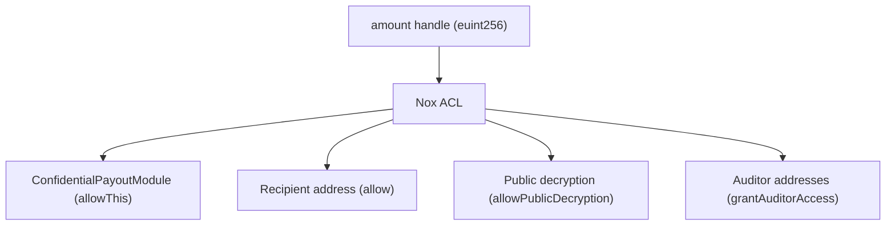

# Privacy Model

Safety provides confidentiality for payout amounts while preserving the auditability and composability of the Gnosis Safe multisig framework.

## What is Private

- **Payout amounts**: The numeric USDC value of each proposed payout. Block explorers see only an opaque `bytes32` handle.
- **Encrypted balance**: The running total of USDC held by the module is stored as `euint256 encryptedBalance`, an encrypted ciphertext handle. No observer can determine the balance without an ACL-permitted decryption request.
- **Debit result**: Whether the balance subtraction succeeded is stored as `ebool debitSuccess`, also an encrypted handle.

## What is Not Private

- **Recipient address**: The destination wallet address for a payout is stored and emitted as plaintext in `PayoutRequested(requestId, recipient)`.
- **That a payout occurred**: The `PayoutRequested` and `PayoutFinalized` events are publicly visible with their request IDs and recipient addresses.
- **Final transfer amount**: When `finalizePayout` executes, the plaintext amount is used in `IERC20.safeTransfer`, which emits a standard ERC-20 `Transfer(from, to, amount)` event visible on block explorers.
- **Module address**: The address of the `ConfidentialPayoutModule` linked to a Safe is publicly discoverable.

:::info Why the final transfer is visible
The privacy guarantee of Safety is that the **proposed** amount is encrypted and invisible during the proposal phase and signature collection phase. At finalization, the amount is revealed to the EVM for exactly one purpose: executing the token transfer. The `Transfer` event is an ERC-20 standard event that cannot be suppressed. This is a design constraint of ERC-20 composability.
:::

## ACL Permission Model

Each encrypted handle has an associated Access Control List managed by the Nox TEE. The ACL defines who can generate a decryption proof for a given handle.

### Permission Set Per Payout Request

When `requestPayout` executes, these ACL permissions are set:

| Handle | Who Gets Access |
|---|---|
| `encryptedBalance` (updated) | Module contract itself + Safe address |
| `amount` | Module contract + recipient + public decryption |
| `debitSuccess` | Module contract + Safe + public decryption |

### Granting Auditor Access

A Safe signer can call `grantAuditorAccess(requestId, auditorAddress)` to allow a specific address (e.g. an external accountant) to request decryption proofs for a payout request's amount handle. This does not expose the amount publicly — the auditor must still query the Nox TEE with their wallet to get a proof.

## Privacy vs. Auditability Balance

| Property | Value |
|---|---|
| Amount visible on block explorer | No (during proposal and queue phase) |
| Recipient visible | Yes |
| Final transfer amount visible | Yes (ERC-20 Transfer event) |
| Balance auditable by Safe signers | Yes (with Nox ACL) |
| Amount auditable by external auditors | Yes (with grantAuditorAccess) |
| Amount derivable by public | No (requires ACL permission from Nox TEE) |
