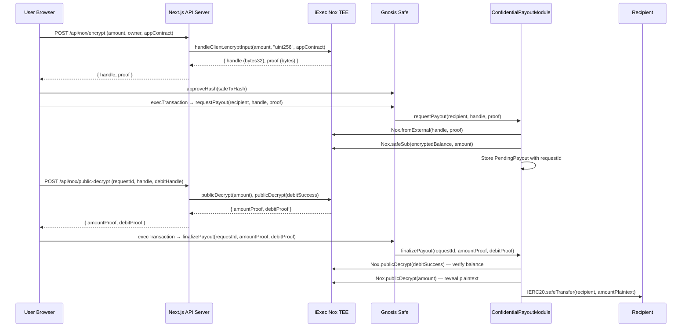

# Safety — Confidential Treasury Layer for Gnosis Safe

Safety is an open-source protocol that adds encrypted payout capabilities to Gnosis Safe multisig smart accounts using the iExec Nox Trusted Execution Environment (TEE) protocol.

Standard Gnosis Safe transactions record every payout amount, token transfer value, and recipient address in plain text on public blockchains. Any block explorer user, competitor, or observer can inspect the full financial history of a treasury.

Safety resolves this by encrypting payout amounts client-side before they touch the blockchain. The encrypted handle travels through the standard Safe multisig approval flow and is settled on-chain by the `ConfidentialPayoutModule`, which uses Nox TEE operations to verify, account, and release funds without revealing the plaintext value to on-chain observers.

## Core Properties

- Payout amounts are encrypted before broadcast and never appear in plaintext in transaction calldata or event logs visible to block explorers.
- The Gnosis Safe multisig approval workflow (signer threshold, `execTransaction`) is preserved without modification.
- No specialized wallets or custom cryptography libraries are required from the end user.
- The module is deployable independently per Safe address, providing complete 1:1 isolation between treasuries.
- Supports both Ethereum Sepolia (Chain ID 11155111) and Arbitrum Sepolia (Chain ID 421614).

## How It Works at a Glance



## Repository Structure

```
safety/
├── contracts/          Hardhat project — Solidity contracts + deploy scripts
│   ├── contracts/
│   │   ├── ConfidentialPayoutModule.sol
│   │   └── ConfidentialPayoutFactory.sol
│   ├── scripts/
│   │   ├── deploy-module.ts
│   │   ├── deploy-factory.ts
│   │   └── deploy-module-for-safe.ts
│   └── hardhat.config.ts
├── frontend/           Next.js 15 application
│   ├── app/
│   │   ├── api/nox/    Server-side Nox SDK routes
│   │   ├── api/safe/   Safe deployment API routes
│   │   ├── dashboard/  Treasury console page
│   │   └── page.tsx    Landing page
│   ├── components/
│   ├── lib/
│   │   ├── hooks/      Wagmi + viem integration hooks
│   │   ├── contracts.ts ABIs + addresses
│   │   ├── deployments.ts Network config
│   │   └── utils/
│   └── .env.local
├── docs/               This Docusaurus documentation site
├── README.md
├── DEPLOYMENT.md
└── FEEDBACK.md
```
