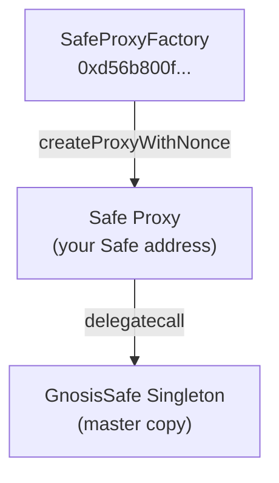

# Gnosis Safe Protocol

## What Gnosis Safe Is

Gnosis Safe (now branded as just "Safe") is the most widely adopted smart contract multisig wallet on EVM-compatible blockchains. It manages over $100 billion in assets for DAOs, DeFi protocols, institutional treasuries, and development teams.

Rather than being controlled by a single private key, a Safe account requires M-of-N authorized signers to approve any transaction before it executes. For example, a 2-of-3 Safe requires any two of three designated signers to collectively sign a transaction before the Safe will execute it on-chain.

## Core Concepts

### Proxy Architecture

Gnosis Safe uses the EIP-1167 minimal proxy pattern. A factory contract (`SafeProxyFactory`) deploys cheap proxy instances pointing to a shared singleton implementation (`GnosisSafe`). Each new Safe is a proxy — this means Safe deployments are inexpensive and isolated.



### Transaction Lifecycle

A standard Gnosis Safe transaction follows this lifecycle:

1. A proposer computes the Safe transaction hash using `getTransactionHash()`.
2. Each required signer calls `approveHash(txHash)` to register their approval on-chain, or signs off-chain using EIP-712.
3. Once the threshold is met, anyone can call `execTransaction(...)` with the collected signatures.
4. The Safe verifies the signatures match the threshold, then executes the transaction.

### Modules

Safe Modules extend the Safe's capabilities through a plugin system. Once a module is enabled on a Safe via `enableModule(moduleAddress)`, that module contract can call `execTransactionFromModule` on the Safe to execute transactions bypassing the signer threshold requirement.

Safety uses the opposite approach: the Safe calls the module (not the module calling the Safe), so the full signer threshold approval is always required. The `ConfidentialPayoutModule` is enabled as a target contract that the Safe calls via standard `execTransaction`.

### Access Control on Modules

The `onlySafe` modifier in `ConfidentialPayoutModule.sol` enforces that only the linked Safe address can call sensitive functions:

```solidity
modifier onlySafe() {
    require(msg.sender == safe, "not safe");
    _;
}
```

This means no external address — not even the module deployer — can call `deposit`, `requestPayout`, or `finalizePayout` directly.

### Key Safe ABI Functions Used by Safety

| Function | Purpose |
|---|---|
| `getTransactionHash(...)` | Computes the EIP-712 typed data hash for a proposed transaction |
| `approveHash(bytes32)` | Registers a signer's on-chain approval of a transaction hash |
| `execTransaction(...)` | Executes a transaction once signature threshold is met |
| `isModuleEnabled(address)` | Checks if a given module address is enabled on the Safe |
| `enableModule(address)` | Enables a module on the Safe |
| `getOwners()` | Returns array of current signer addresses |
| `getThreshold()` | Returns current required signature count |
| `nonce()` | Returns current transaction nonce |

## Prevalidated Signature Format

Safety uses Gnosis Safe's native prevalidated signature format (`v = 1`) to avoid off-chain ECDSA signing complexity:

```typescript
export function buildPrevalidatedSig(signerAddress: Address): `0x${string}` {
  return `0x000000000000000000000000${signerAddress.slice(2).toLowerCase()}000000000000000000000000000000000000000000000000000000000000000001` as `0x${string}`;
}
```

The format is:
- `r` = the signer's address (padded to 32 bytes)
- `s` = 32 zero bytes
- `v` = `01` (indicating prevalidated signature)

This works because the signer calls `approveHash(txHash)` first, so the Safe knows this address approved the hash. The prevalidated signature just references that approval.

## Official Resources

- [Safe Documentation](https://docs.safe.global)
- [Safe Protocol Kit](https://docs.safe.global/sdk/protocol-kit)
- [Safe Contracts GitHub](https://github.com/safe-global/safe-contracts)
