# iExec Nox Protocol

## What iExec Nox Is

iExec Nox is a confidential computing layer that enables smart contracts to perform arithmetic on encrypted values without ever exposing the underlying plaintexts on-chain. It combines on-chain Solidity smart contracts with off-chain Trusted Execution Environments (TEEs) to create a practical privacy layer for EVM-compatible DeFi applications.

Nox uses hardware-isolated enclaves (TEEs, specifically Intel SGX) to execute sensitive computations. The TEE produces cryptographic proofs of its computation results, which are verified by on-chain Nox contracts without revealing the input values.

## Core Concepts

### Encrypted Types

Nox introduces first-class encrypted type aliases for Solidity:

| Nox Type | Underlying Type | Description |
|---|---|---|
| `euint256` | `bytes32` | Encrypted unsigned 256-bit integer |
| `ebool` | `bytes32` | Encrypted boolean |
| `externalEuint256` | `bytes32` | External encrypted uint256 handle (from client SDK) |

These types are ciphertext handles — 32-byte references to encrypted values stored and managed by the Nox TEE. On public block explorers, they appear as opaque `bytes32` values.

### Access Control Lists (ACLs)

Every encrypted handle has an associated ACL. The ACL defines which Ethereum addresses are permitted to generate decryption proofs for that handle. ACL entries are set by calling:

- `Nox.allow(handle, address)` — grant decryption access to an address
- `Nox.allowThis(handle)` — grant decryption access to the calling contract itself
- `Nox.allowPublicDecryption(handle)` — allow anyone to request public decryption proofs

Only addresses with ACL permission can request the Nox TEE to generate a valid decryption proof for a given handle. Without a proof, the plaintext cannot be recovered.

### Key Nox Operations Used in Safety

```mermaid
graph LR
    A["handleClient.encryptInput(amount)"] -->|Client SDK| B["externalEuint256 handle + proof"]
    B -->|on-chain| C["Nox.fromExternal(handle, proof)"]
    C --> D["euint256 amount"]
    D --> E["Nox.safeSub(balance, amount)"]
    E --> F["ebool debitSuccess + euint256 newBalance"]
    F --> G["Nox.select(debitSuccess, newBalance, balance)"]
    G --> H["Updated encryptedBalance"]
```



| Operation | Description |
|---|---|
| `Nox.toEuint256(uint256)` | Encrypts a plaintext value into a `euint256` handle |
| `Nox.fromExternal(externalEuint256, bytes)` | Validates a client-generated encrypted handle and proof; imports it as a usable `euint256` |
| `Nox.add(euint256, euint256)` | Encrypted addition |
| `Nox.safeSub(euint256, euint256)` | Encrypted subtraction that returns an `ebool` debit success flag |
| `Nox.select(ebool, euint256, euint256)` | Encrypted ternary: returns first value if `ebool` is true, else second |
| `Nox.publicDecrypt(euint256 or ebool, bytes)` | Verifies a public decryption proof and returns the plaintext value |
| `Nox.allow(handle, address)` | Grants an address ACL permission to decrypt a handle |
| `Nox.allowThis(handle)` | Grants the calling contract ACL permission |
| `Nox.allowPublicDecryption(handle)` | Marks handle as publicly decryptable |

### Client-Side SDK (`@iexec-nox/handle`)

The JavaScript/TypeScript SDK allows client-side code to encrypt values before sending them on-chain. The `createViemHandleClient` function creates a handle client bound to a wallet.

```typescript
import { createViemHandleClient } from "@iexec-nox/handle";

const handleClient = await createViemHandleClient(walletClient);

const { handle, handleProof } = await handleClient.encryptInput(
  BigInt(amountInSmallestUnit),
  "uint256",
  appContractAddress,
);
```

The resulting `handle` is a `bytes32` ciphertext reference and `handleProof` is a TEE-signed bytes payload. Both are sent to the `requestPayout` on-chain function.

### Public Decryption Flow

To finalize a payout, the plaintext amount must be revealed to the EVM so the ERC-20 transfer can execute. This uses public decryption:

1. The handle must have `allowPublicDecryption` set (done in `requestPayout`).
2. The server calls the Nox TEE to generate a public decryption proof via `publicDecrypt(handle)`.
3. The proof is submitted on-chain to `finalizePayout(requestId, amountProof, debitProof)`.
4. `Nox.publicDecrypt(handle, proof)` verifies the proof and returns the uint256 plaintext.

This is the only moment the plaintext amount appears in the EVM execution context — and it is never stored on-chain permanently.

## Constructor Restriction

:::warning Important
Nox enclave operations **cannot** be called during contract construction (inside `constructor()`). During contract creation, `extcodesize(address(this))` is `0`, and the Nox TEE validates contract code existence before processing requests. Calls to `Nox.toEuint256` or any other Nox operation during `constructor` will cause the deployment transaction to revert.
:::

Safety resolves this with lazy initialization: `encryptedBalance` is seeded to zero using `Nox.toEuint256(0)` on the first call to `deposit()`, after the contract is fully deployed.

## Gas Requirements

Nox operations are computationally expensive. Each Nox call involves off-chain TEE computation and on-chain proof verification:

| Function | Nox Ops Count | Approximate Gas |
|---|---|---|
| `deposit()` (first call) | `toEuint256` + 2× `allow` | ~80,000 |
| `deposit()` (subsequent) | `toEuint256` + `add` + 2× `allow` | ~120,000 |
| `requestPayout()` | `fromExternal` + `safeSub` + `select` + 5× `allow` + 2× `allowPublicDecryption` | 300,000 – 500,000 |
| `finalizePayout()` | 2× `publicDecrypt` | 200,000 – 350,000 |

Safety sets all `execTransaction` gas limits to **600,000** for module calls to accommodate the worst case.

## Supported Networks

| Network | Chain ID | NoxCompute Contract |
|---|---|---|
| Ethereum Sepolia | 11155111 | Deployed and active |
| Arbitrum Sepolia | 421614 | Deployed and active |

## Official Resources

- [iExec Nox Documentation](https://docs.iex.ec/nox-protocol)
- [nox-protocol-contracts npm](https://www.npmjs.com/org/iexec-nox)
- [Nox Hardhat Plugin](https://github.com/iExec-Nox/nox-hardhat-plugin)
- [Confidential DeFi Wizard](https://cdefi-wizard.iex.ec/)
